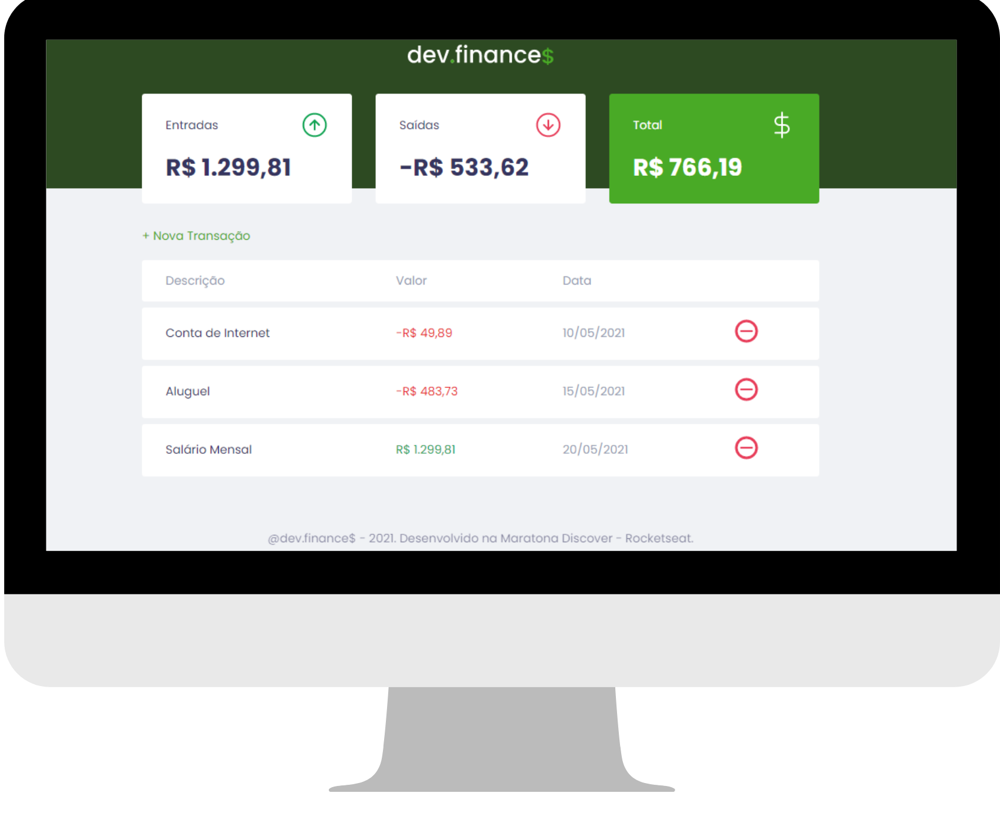

<h1 align="center">
  
</h1>

  <a href="#-tecnologias">Tecnologias</a>&nbsp;&nbsp;&nbsp;|&nbsp;&nbsp;&nbsp;
  <a href="#-projeto">Projeto</a>&nbsp;&nbsp;&nbsp;|&nbsp;&nbsp;&nbsp;
  <a href="#-deploy">Deploy - Projeto Online</a>&nbsp;&nbsp;&nbsp;|&nbsp;&nbsp;&nbsp;

 

 

## 🚀 Tecnologias

Esse projeto foi desenvolvido com as seguintes tecnologias:

- HTML
- CSS
- JavaScript

## 💻 Projeto

O dev.finances é uma aplicação de controle financeiro, onde é possível cadastrar e excluir transações e ver o saldo de entrada e saída, os dados ficam salvos no Storage do navegador 💰

## 🔖 Deploy

Foi realizado o deplo do projeto utilizando a plataforma Vercel, <a href="https://dev-finance-red.vercel.app/" target="_blank" > Clique aqui para visualizar o projeto Online </a>

## Encontre-me:

- 🌍 [Linkedin](https://www.linkedin.com/in/joao-lopes-071026198/)

